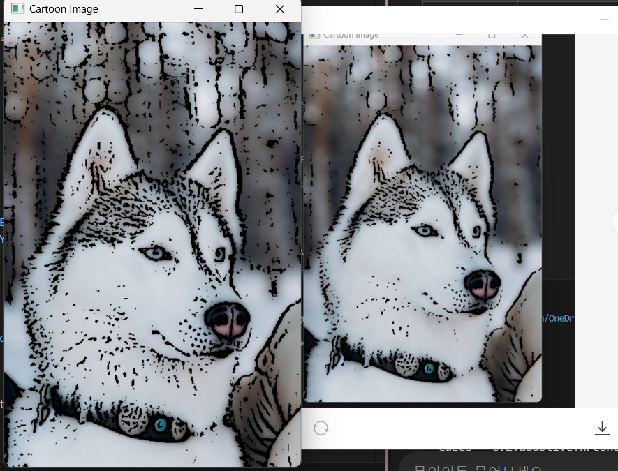
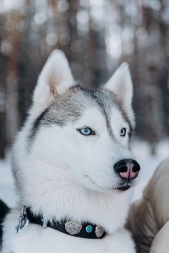
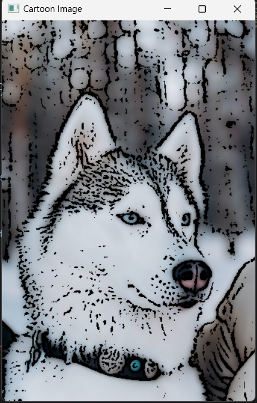
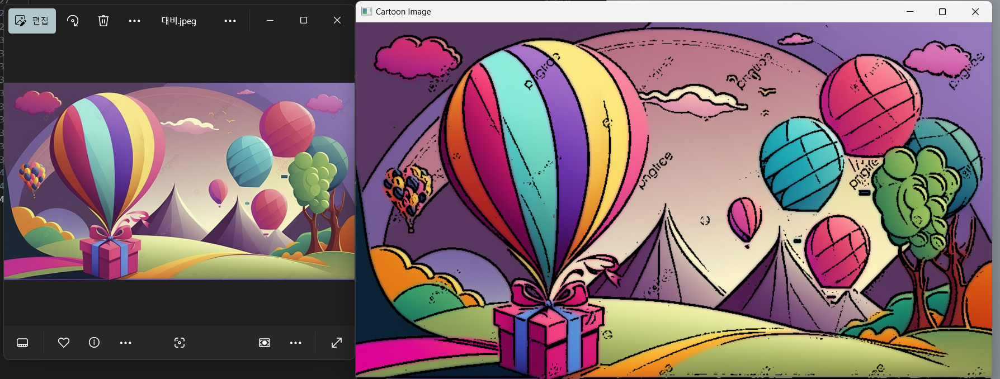
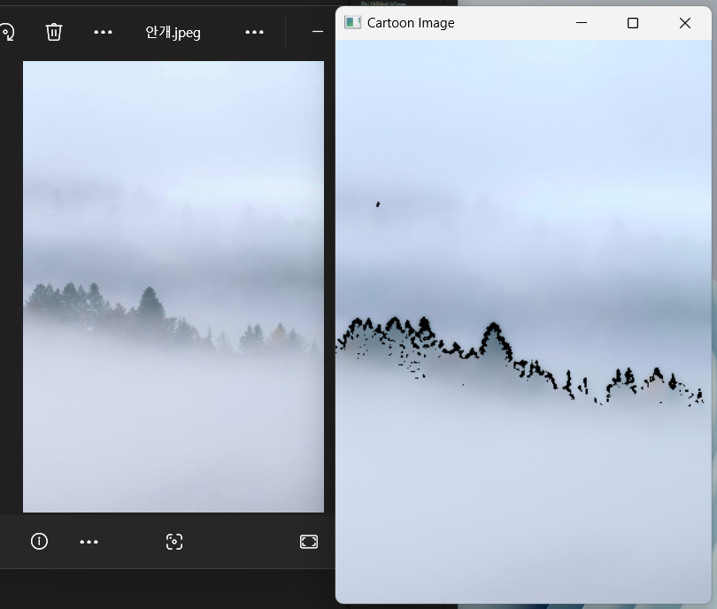

# Cartoonize Your Image!!!

## What is this?
`cartoonize_your_image.py`는 OpenCV의 다양한 필터링 및 임계값 변환 기법을 통해, 입력된 이미지를 처리하여 윤곽선을 강조하고 색상을 부드럽게 변환하여 만화 같은 이미지를 생성하는 프로그램입니다.

## Functionality of 'cartoonized_your_image' Program

### 1. 라이브러리 불러오기
```python
import cv2
import numpy as np
```
- `cv2`: OpenCV 라이브러리로 이미지 처리 기능 제공
- `numpy`: 행렬 연산을 위한 라이브러리

### 2. `cartoonize_image` 함수 정의
```python
def cartoonize_image(image_path, output_path):
```
이 함수는 입력된 이미지를 만화 스타일로 변환하여 저장하는 기능을 함함

#### 2.1 이미지 불러오기
```python
img = cv2.imread(image_path)
if img is None:
    print(f"이미지를 불러올 수 없습니다. 경로를 확인하세요.")
    return
```
- `cv2.imread(image_path)`: 지정된 경로의 이미지를 불러옴
- `if img is None`: 이미지가 올바르게 불러와지지 않으면 오류 메시지를 출력하고 종료함

#### 2.2 그레이스케일 변환
```python
gray = cv2.cvtColor(img, cv2.COLOR_BGR2GRAY)
```
- 이미지를 흑백으로 변환하여 색상정보를 제거함으로써 윤곽선 검출에 용이하게 만듦

#### 2.3 노이즈 제거, 블러 처리
```python
gray_blur = cv2.medianBlur(gray, 3)
```
- `cv2.medianBlur(gray, 3)`: medianBlur를 적용하여 노이즈를 줄이고 이미지의 세부 요소를 부드럽게 만들어서, 윤곽선 검출에 용이하게 만듦

#### 2.4 윤곽선 검출
```python
edges = cv2.adaptiveThreshold(gray_blur, 255,
                              cv2.ADAPTIVE_THRESH_MEAN_C,
                              cv2.THRESH_BINARY, 7, 3)
```
- `cv2.adaptiveThreshold()`: 이미지의 밝기에 따라 적응형 임계값을 적용하여 윤곽선을 추출함

##### 코드 설정 과정


- 왼쪽 사진의 설정 코드
- edges = cv2.adaptiveThreshold(gray_blur, 255,
                              cv2.ADAPTIVE_THRESH_MEAN_C,
                              cv2.THRESH_BINARY, 7, 3)
   
- 오른쪽 사진의 설정 코드 
- edges = cv2.adaptiveThreshold(gray_blur, 255,
                              cv2.ADAPTIVE_THRESH_MEAN_C,
                              cv2.THRESH_BINARY, 7, 5)

  
- 변화시키려는 원본 이미지가 '털이 있는 개'이기에 개털을 강조하고자 함
- block size:7 그리고 상수 c값을 5로 설정한 이미지가 털이 덜 도드라져 보였음
- 털의 윤곽이 더 보였으면 하기에 5에서 3으로 c값을 수정함
- 블록 크기는 7, 상수 c는 3으로 하여 (7,3)으로 최종 설정함.

#### 2.5 색상 부드럽게 만들기
```python
color = cv2.bilateralFilter(img, 9, 300, 300)
```
- `cv2.bilateralFilter()`: 경계를 유지하면서 색상을 부드럽게 하여 만화 느낌이 강조될 수 있게 함

#### 2.6 만화 효과 적용
```python
cartoon = cv2.bitwise_and(color, color, mask=edges)
```
- `cv2.bitwise_and()`: 윤곽선과 부드러운 색상을 결합하여 만화 효과가 적용된 이미지를 생성함

#### 2.7 결과 저장 및 출력
```python
cv2.imwrite(output_path, cartoon)
cv2.imshow("Cartoon Image", cartoon)
cv2.waitKey(0)
cv2.destroyAllWindows()
```
- `cv2.imwrite(output_path, cartoon)`: 변환된 이미지를 지정된 경로에 저장함
- `cv2.imshow()`: 변환된 이미지를 화면에 출력함


## 커스텀 입력 경로 사용하기
기본 이미지 경로 대신 다른 이미지를 변환하고 싶다면 `cartoonize_image` 함수 호출 시 직접 경로를 지정하면 됨
```python
cartoonize_image("path_to_your_image.jpg", "output_cartoon.jpg")
```


# !!! program 적용 예시!!!
## original image

## cartoonized image result



# Demos and limitations
## 1) 만화 같은 느낌이 잘 표현되는 이미지 데모 
- 선명한 윤곽선이 있는 이미지 : 대비가 크면 윤곽선 검출 시 선명한 경계 추출 가능
- 배경이 단순하고 색상의 대비가 뚜렷한 이미지 :윤곽선 검출 과정에 노이즈가 적어 용이
- 고화질의 사진: 해상도가 낮으면 윤곽선 검출 시 디테일 손실 가능성이 존재하기에
**잘 표현된 예시:**
 


## 2) 만화 같은 느낌이 잘 표현되지 않는 이미지데모
- 너무 어둡거나 대비가 낮은 이미지 : 명암 차이가 적으면 대비가 낮아 윤곽선 검출이 어렵고 경계가 흐릿하게 표현됨
- 너무 많은 노이즈가 포함된 이미지 : 만화 효과 대신 복잡하고 어수선한 느낌의 이미지가 될 가능성 높음
- 윤곽선이 약한 부드러운 이미지 (예: 안개 낀 풍경, 흐릿한 사진)
**잘 표현되지 않은 예시:**


## NOTE
- 명확한 대비를 가진 고해상도, 단순 배경의 이미지가 가장 잘 적용이 될 것임
- 복잡한 배경, 저해상도 이미지, 대비가 적은 이미지는 잘 변환되기에 어려움이 존재함 

## 3) 내가 만든 프로그램 알고리즘의 한계점

1. **적응형 임계값 조정 어려움**  
   - `cv2.adaptiveThreshold()` 적용 시 이미지에 따라 윤곽선 검출이 과도하거나 부족할 수 있음
   - 특정 스타일의 이미지에는 적합하지만, 모든 사진에서 최적의 결과를 보장하기 어려움
   - 현재 코드에서는 `cv2.ADAPTIVE_THRESH_MEAN_C` 방식을 사용하고 있으며, 블록 크기(7)와 상수(3)의 값이 고정되어 있어 다양한 이미지에서 최적화가 어려움

2. **복잡한 배경에서 변환 어려움**  
   - 배경이 복잡하면 불필요한 윤곽선이 과도하게 검출될 가능성이 있음
   - 결과적으로 가독성이 떨어지는 이미지가 될 수 있음
   - 현재 코드에서는 배경 분리를 위한 추가적인 기법(예: GrabCut, Edge Detection 후 후처리)이 적용되지 않아 복잡한 배경에서 정확한 윤곽선 검출이 어려움

3. **색상 부드럽게 처리 시 디테일 손실 가능**  
   - `cv2.bilateralFilter()` 값이 고정(`d=9, sigmaColor=300, sigmaSpace=300`)되어 있어 이미지에 따라 너무 부드럽거나 충분한 만화 효과가 나오지 않을 수 있음
   - 배경과 객체 간의 대비가 약한 경우, 색상의 경계가 제대로 유지되지 않을 가능성이 있음

4. **해상도에 따른 품질 저하**  
   - 낮은 해상도의 이미지는 변환 결과가 부자연스러울 수 있음
   - 현재 코드에서는 입력 이미지의 크기를 조정하는 단계가 없어, 고해상도와 저해상도 이미지에서 일관된 효과를 내기 어려움
   - Adaptive Thresholding과 Bilateral Filtering이 해상도에 따라 다르게 동작하여, 동일한 효과를 유지하려면 동적 조정이 필요함

5. **일반적인 적용 한계**  
   - 특정 스타일의 이미지에 최적화되어 있어 모든 유형의 이미지에서 일관된 효과를 기대하기 어려움
   - 현재 코드에서는 사용자 입력값을 조정할 수 있는 인터페이스가 없고, 모든 이미지에 동일한 파라미터를 적용함
   - 이미지별 최적의 파라미터를 찾기 위해 `trackbar` 또는 `config` 파일을 활용하는 방법이 고려될 수 있음


## 추가적인 개선 방안
1. 자동 최적화된 윤곽선 검출 값 적용
   - `cv2.Canny()`를 추가하여 윤곽선 검출을 보완할 수 있음
   - `cv2.adaptiveThreshold()`의 `blockSize`와 `C` 값을 이미지 분석 후 동적으로 조정

2. 배경을 제거하는 기능 추가
   - OpenCV 또는 딥러닝 기반 모델을 사용하여 사람/사물만 남기고 배경을 제거하는 기능을 추가하는 것 가능
   - 이를 통해서 복잡한 배경에서도 더 적절한 만화 효과 적용 가능

3. 이미지 크기에 따른 가변적인 블러 처리
   - `cv2.medianBlur()`의 커널 크기를 이미지 해상도에 따라 조절하면 저해상도 이미지에서도 적절한 효과 가능할 것


